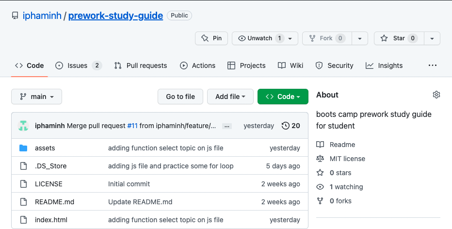

# Prework-Study-Guide
## Boots Camp Prework Study Guide for Student

- Challenging with basic coding 
- To gain the computional thinking over the prework. 
- Helping to connect with new tech community

## Installation

Google DEV 
Slack
Screencastify
Visual Code

## Usage
I have four branches

* Main
* feature/add-css
* feature/add-HTML
* feature/add-js
* feature/starter-code

## Credits

* ChatGPT 
* Youtube
* Google
- https://chat.openai.com/chat
- https://www.youtube.com/@coreyms
- https://code.visualstudio.com/docs/nodejs/browser-debugging

## License

[MIT License](https://choosealicense.com/licenses/mit/)
---

## Badges

## Features

- CSS
- HTML
- JavaScript
- Github

## How to Contribute

